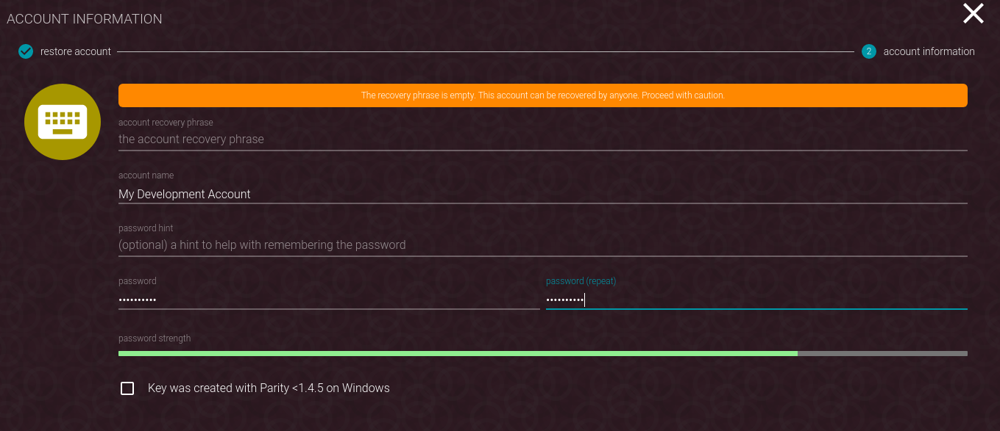
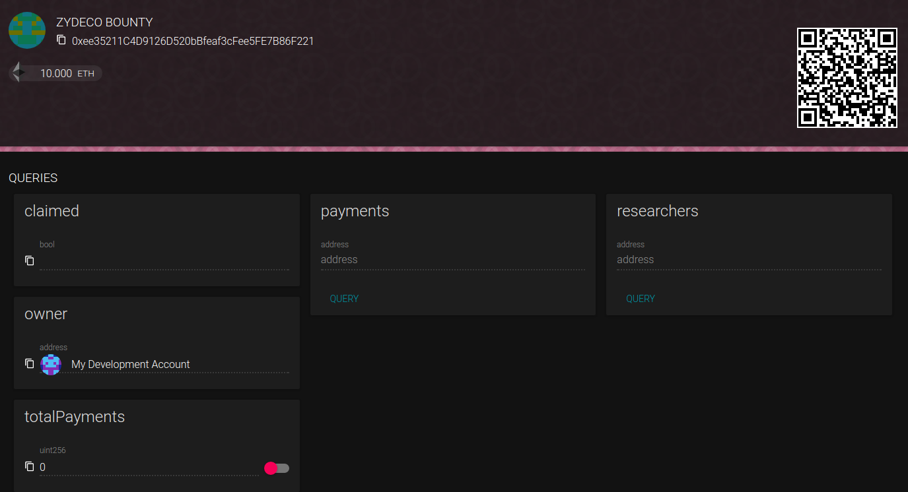
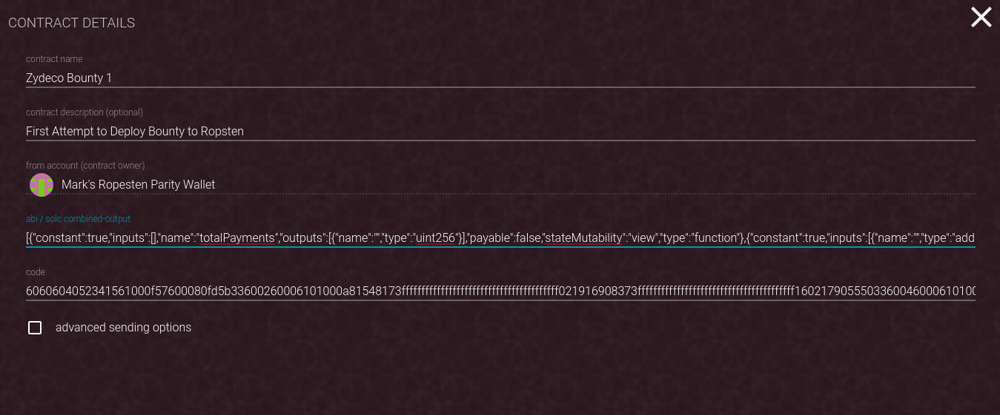
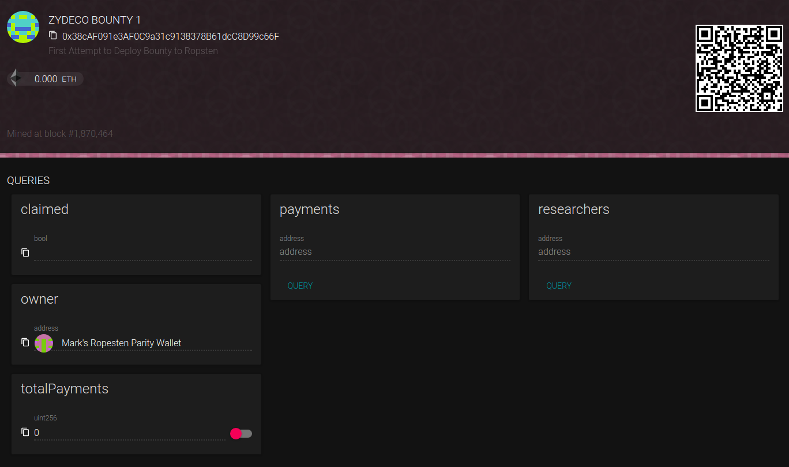
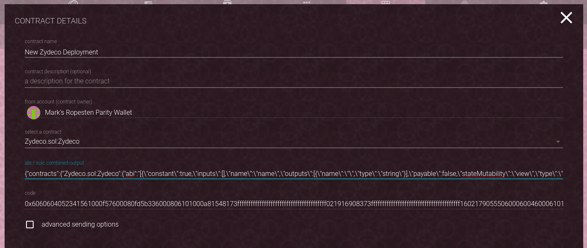
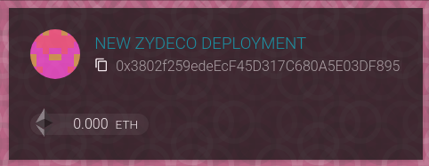
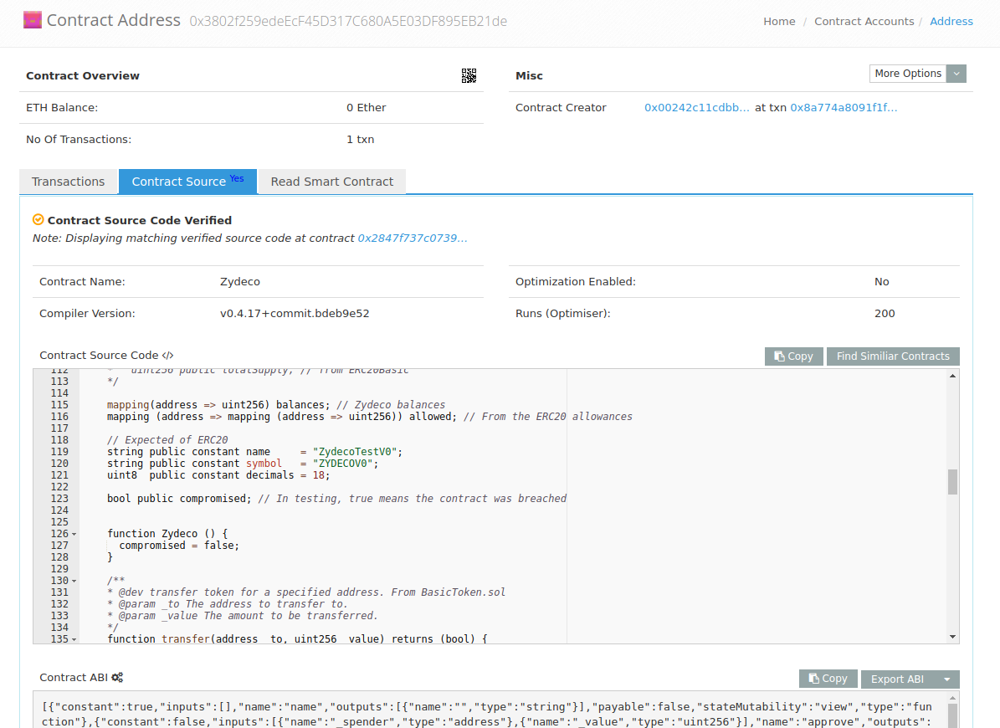

Development Notes
=================

Using Open Zeppelin makes things a little more complicated to deploy: there
are several dependencies which must be deployed, and a simple paste into the
deployment dialog won't cut it.

In these notes I'll describe how to work with the contract in a reasonable
way. Note that the ``testrpc`` network should work out of the box for testing::

  testrpc
  truffle test

The Development Network
-----------------------

Parity includes a development network, similar to ``testrpc``. To use it, one
needs to initialize the network and create an account.

Starting Development Net
........................

The first time through, one should start the development network with
a command like:

.. code::

  parity --chain dev

Creating the Account
....................

From the parity interface, one should choose Accounts-> Restore. Enter the
necessary information, but *leave the recover phrase blank*.



This will create an account with billions and billions of initial ether.

Modify ``truffle.js``
.....................

Next, you'll want to let truffle know which account to use, and you'll want
to increase the ether gas limit. This is done with the ```gas`` and
``from`` keys. Given the address of the account you just created.

.. code:: javascript

  module.exports = {
    networks: {
      development: {
        host: "localhost",
        port: 8545,
        network_id: "*", // Match any network id
        from: "0x00a329c0648769A73afAc7F9381E08FB43dBEA72",
        gas: 5000000
      }
    }
  };

Restart Parity
..............

To make things easier, parity should be restarted with the following
options::

  parity --chain dev --reseal-min-period 0 \
    --unlock 00a329c0648769A73afAc7F9381E08FB43dBEA72 \
    --password pass.txt \
    --force-ui

A few things to note:

* The account being unlocked does not include the "0x" prepended
  characters.
* ``pass.txt`` includes the password for the account you just created.

Note that you can bring up parity without the ``--unlock`` and ``--password``.
If you do this, you'll need to have the GUI running and sign the transactions
when asked.

Once you've started parity, you should see the chain running, but with
no peers::

  vagrant@crypto:~$ parity --chain dev --reseal-min-period 0 --unlock 00a329c0648769A73afAc7F9381E08FB43dBEA72 --password pass.txt
  2017-10-14 12:19:49  Starting Parity/v1.7.3-beta-d097956-20171009/x86_64-linux-gnu/rustc1.20.0
  2017-10-14 12:19:49  Keys path /home/vagrant/.local/share/io.parity.ethereum/keys/DevelopmentChain
  2017-10-14 12:19:49  DB path /home/vagrant/.local/share/io.parity.ethereum/chains/DevelopmentChain/db/125ccdc70e48df86
  2017-10-14 12:19:49  Path to dapps /home/vagrant/.local/share/io.parity.ethereum/dapps
  2017-10-14 12:19:49  State DB configuration: fast
  2017-10-14 12:19:49  Operating mode: active
  2017-10-14 12:19:49  Configured for DevelopmentChain using InstantSeal engine
  2017-10-14 12:19:54  Public node URL: enode://0ddd6262025b3971c9a0ef133c6b720116b78608f915dcae586ab92760006b02a57632945c2bfdc938a74170a0204f3307194bf1facfc47384ed728747b2fb76@10.0.2.15:30303
  2017-10-14 12:20:24     0/25 peers   8 KiB chain 32 KiB db 0 bytes queue 448 bytes sync  RPC:  0 conn,  0 req/s,   0 µs


We can now deploy the contracts::

  vagrant@crypto:~/git/coin$ truffle migrate
  Compiling ./contracts/Zydeco.sol...
  Compiling ./contracts/ZydecoBounty.sol...
  Compiling zeppelin-solidity/contracts/Bounty.sol...
  Compiling zeppelin-solidity/contracts/lifecycle/Destructible.sol...
  Compiling zeppelin-solidity/contracts/math/SafeMath.sol...
  Compiling zeppelin-solidity/contracts/ownership/Ownable.sol...
  Compiling zeppelin-solidity/contracts/payment/PullPayment.sol...
  Compiling zeppelin-solidity/contracts/token/ERC20.sol...
  Compiling zeppelin-solidity/contracts/token/ERC20Basic.sol...
  Writing artifacts to ./build/contracts

  Using network 'development'.

  Running migration: 1_initial_migration.js
    Replacing Migrations...
    ... 0x87f62bb14cd775e1b4b0de6d1882ac80dad0e6ee00a54d56d550717326a3fae9
    Migrations: 0x731a10897d267e19b34503ad902d0a29173ba4b1
  Saving successful migration to network...
    ... 0xe071f0134017835b0d70d529ee9777a8cba1c96d13f4fe527bd9e0d035a44d07
  Saving artifacts...
  Running migration: 2_deploy_contracts.js
    Replacing Zydeco...
    ... 0x9def603901a3539851474dc36e290b22016c15837a24e0a10189b59325af632a
    Zydeco: 0x62d69f6867a0a084c6d313943dc22023bc263691
    Replacing ZydecoBounty...
    ... 0x52e77e2f9c9c0ba38cb3569096c890f4d39469042cabd79ae85b1825f68695e1
    ZydecoBounty: 0xee35211c4d9126d520bbfeaf3cfee5fe7b86f221
  Saving successful migration to network...
    ... 0xd9a03d61b8037485fde4f7b431d14aae926489143b5c72d809d1354bc92d7684
  Saving artifacts...

The addresses of ``Zydeco`` and ``ZydecoBounty`` are important, so they
should be noted.

Watching the Contract in Parity
...............................

A second complexity is that we need to generate the ABI for the contract
watcher, but the ``solcjs`` compiler does not honor the import statement;
thus all input files (and *their* dependencies) need to be specified on
the command line.

Unfortunately, it seems like the contract has to be copied to the
``node_modules`` directory for the compilation to work.

.. code:: bash

  cp contracts/* node_modules/
  cd node_modules/
  solcjs --abi Zydeco.sol \
    Dividend.sol \
    zeppelin-solidity/contracts/ownership/Ownable.sol  \
    zeppelin-solidity/contracts/token/ERC20.sol \
    zeppelin-solidity/contracts/math/SafeMath.sol \
    zeppelin-solidity/contracts/Bounty.sol \
    zeppelin-solidity/contracts/payment/PullPayment.sol  \
    zeppelin-solidity/contracts/lifecycle/Destructible.sol  \
    zeppelin-solidity/contracts/token/ERC20Basic.sol \
    zeppelin-solidity/contracts/token/StandardToken.sol \
    zeppelin-solidity/contracts/token/BasicToken.sol


``ZydecoBouty.sol`` can be compiled similarly, but one will need to
explicitly add ``Zydeco.sol`` to the supplied files.

.. code:: bash

  solcjs --abi \
    ZydecoBounty.sol \
    Zydeco.sol \
    Dividend.sol \
    zeppelin-solidity/contracts/ownership/Ownable.sol  \
    zeppelin-solidity/contracts/token/ERC20.sol \
    zeppelin-solidity/contracts/math/SafeMath.sol \
    zeppelin-solidity/contracts/Bounty.sol \
    zeppelin-solidity/contracts/payment/PullPayment.sol  \
    zeppelin-solidity/contracts/lifecycle/Destructible.sol  \
    zeppelin-solidity/contracts/token/ERC20Basic.sol \
    zeppelin-solidity/contracts/token/StandardToken.sol \
    zeppelin-solidity/contracts/token/BasicToken.sol

Once the address has been noted and the ABI has been generated, it
become possible to interact with the contract via the GUI.

We can also send some ether to the bounty contract.



Deploying Externally
--------------------

I have not been able to deploy to ropsten with truffle, and I assume that
the issues I'm seeing would apply to the foundation network too.

To deploy the contract externally, you'll need to produce both an ABI and
binary file. So, for example, in deploying the bounty:

.. code:: bash

  solcjs \
    --abi \
    --bin \
    ZydecoBounty.sol \
    Zydeco.sol \
    zeppelin-solidity/contracts/ownership/Ownable.sol  \
    zeppelin-solidity/contracts/token/ERC20.sol \
    zeppelin-solidity/contracts/math/SafeMath.sol \
    zeppelin-solidity/contracts/Bounty.sol \
    zeppelin-solidity/contracts/payment/PullPayment.sol  \
    zeppelin-solidity/contracts/lifecycle/Destructible.sol  \
    zeppelin-solidity/contracts/token/ERC20Basic.sol \
    zeppelin-solidity/contracts/token/StandardToken.sol \
    zeppelin-solidity/contracts/token/BasicToken.sol

This will create both the files, and they can be pasted into the deployment
box in the parity client.



In a few minutes it will be deployed and you will have the interface in
your client:



This procedure could be used for the development network also.

Using the C Compiler
....................

The process of externally deploying (either on the main or testing network)
is somewhat easier if one installs the ``solc`` compiler and doesn't realy on
the ``solcjs`` version that is installed via ``npm``. Again, one should copy the
files being compiled to the ``node_modules`` directory of the project,
but the actual compilation command is easier::

  cd node_modules
  cp ../contracts/Zydeco* .
  solc -o . --bin --abi ZydecoBounty.sol

will create the ``bin`` and ``abi`` files in the current directory. Also note
that ``solc`` supports an output format that supports a combination of the binary
and ABI files, and the parity client also supprts this. The command::

  solc --combined-json bin,abi Zydeco.sol -o .

will create a single file, ``combined.json``, that can be pasted into the
contract deployment form.


Publishing and Verifying Source Code
------------------------------------

The source code to a smart contract can be associated with the contract
as it exists on the block-chain in a verifiable way. To show how this is done,
let's deploy the ``combined.json`` file from above.



Once it is deployed you will be able to see it's address:



To verify the code, you will first need to flatten it -- in other words,
the dependency graph needs to be walked and all imports need to be
lexically substituted for the actual code being imported.

The easiest way to do this is to use the `solidity flattener <https://github.com/BlockCatIO/solidity-flattener>`__ tool
that is available on GitHub. The following command will create a file,
``flattened.sol``, which does this::

  solidity_flattener --output flattened.sol Zydeco.sol

(note this is a python command and you will need python 3.5+ installed).
If one looks up the contract on `Etherscan <https://ropsten.etherscan.io/address/0x3802f259edeecf45d317c680a5e03df895eb21de#code>`__ ,
one can paste this file into the verification tab so that other will know what code
produced the file. Note that you'll need to correctly set the compiler version,
contract name, and optimization setting for this to work. Once it's successfully done,
anyone can see the source code associated with contract, for verification and
research purposes.



An identical procedure can be used for the Foundation (production) network.

Getting Ether
-------------

If you're working on the testing network (ropsten), you will need ether. The easiest way is via
a faucet, for example http://faucet.ropsten.be:3001/. You can paste your account address into
the form and in short order get 3 ether, which should last a while.

One can also try ones hand at mining by installing ``ethminer``. To do this start
parity with the ``author`` flag, ie::

  parity --chain ropsten --author 00242c11CDbB65a14E9A5642BCb431d22675a7dE

(note the lack of ``0x`` from the account address). Then, in a different
terminal::

  ethminer # with the CPU
  # or ...
  ethminer -G # If you have GPGPU computing via OpenCL.

Of the two ways, the faucet is easiest.
